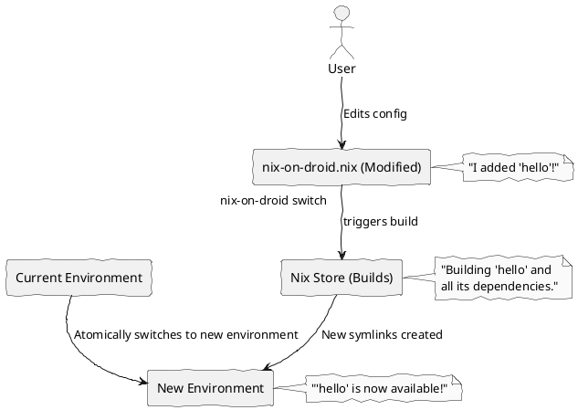
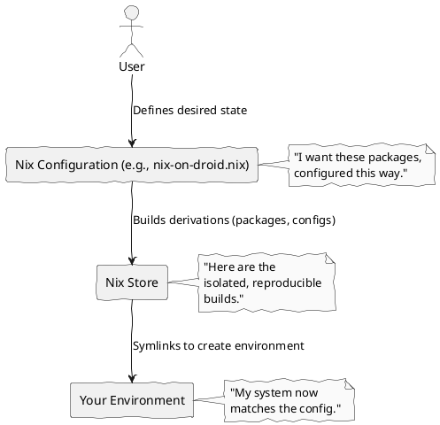

# pick-up-nix

This repository contains my NixOS and Nix-on-Droid configurations.

**NixOS Configuration**
The NixOS configuration is located in the `.config/nix/configuration.nix` file.

**Nix-on-Droid Configuration**
The Nix-on-Droid configuration is located in the `.config/home-manager/home.nix` file.

---

## 🚀 Nix-on-Droid for N00bs: A Multi-Part Tutorial 🚀

Welcome, aspiring Nix-on-Droid wizard! This tutorial will guide you through the basics of using Nix to manage your Android environment. Get ready for a journey into reproducible and powerful mobile configurations!

### How to Render PlantUML Diagrams

Throughout this tutorial, you'll find code blocks marked with `plantuml`. To view these diagrams, you'll need a PlantUML renderer. You can use:

*   **Online Renderer:** Copy the PlantUML code into an online renderer like [PlantUML Online Server](http://www.plantuml.com/plantuml/uml).
*   **Local Setup:** Install PlantUML (e.g., `nix-env -iA nixpkgs.plantuml`) and use the `plantuml` command-line tool to generate images.

### Part 2: Your First Nix-on-Droid Configuration

Ready to get your hands dirty? Let's install your first package using Nix-on-Droid!

Your Nix-on-Droid configuration lives in a special file: `~/.config/nix-on-droid/nix-on-droid.nix`. This is where you declare all the packages and settings you want for your mobile environment.

1.  **Open your configuration file:**

    ```bash
    # You can use 'vim', 'nano', or any editor you prefer
    vim ~/.config/nix-on-droid/nix-on-droid.nix
    ```

2.  **Find the `environment.packages` section:**

    You'll see a section that looks something like this:

    ```nix
      environment.packages = with pkgs; [
        # User-facing stuff that you really really want to have
        vim
        git
        gemini-cli
        emacs
        # ... other packages ...
      ];
    ```

3.  **Add a new package:**

    Let's add the `hello` package, a classic first program that simply prints "Hello, world!". Add `hello` to the list, making sure to keep the correct Nix syntax (commas between items, and within the `[` and `]` brackets).

    ```nix
      environment.packages = with pkgs; [
        # User-facing stuff that you really really want to have
        vim
        git
        gemini-cli
        emacs
        hello # <-- Add this line!
        # ... other packages ...
      ];
    ```

4.  **Apply your changes:**

    Save the file and exit your editor. Now, it's time to tell Nix-on-Droid to apply your new configuration. This is done with the `switch` command:

    ```bash
    nix-on-droid switch --flake ~/.config/nix-on-droid
    ```

    Nix will now download (if necessary) and build the `hello` package, and then activate it in your environment. You'll see a lot of output as Nix works its magic. Once it's done, you should be able to run `hello`!

    ```bash
    hello
    # Expected output: Hello, world!
    ```

---

#### 🗺️ The `switch` Command in Action

This diagram illustrates what happens when you run `nix-on-droid switch`:



---

#### 🖼️ Imagen Prompt: "Happy Package Installation"

Imagine a vibrant, cartoon-style illustration. A friendly, anthropomorphic package (perhaps a small, smiling box with arms and legs) is joyfully leaping into a smartphone screen. The screen displays a simplified command line interface with the text "hello, world!". Bright, colorful lines and stars emanate from the package, symbolizing successful installation. The background is a soft, warm gradient, suggesting a feeling of accomplishment and ease. The overall mood is playful and triumphant.

---

### Part 3: Understanding `environment.packages` and `pkgs`

You've seen `environment.packages = with pkgs; [...]` a few times now. Let's break down what `with pkgs;` means and how to find more packages.

*   **`environment.packages`**: This is a NixOS/Nix-on-Droid option that tells your system which packages you want to have available in your user environment. When you run `nix-on-droid switch`, Nix ensures these packages are built (if necessary) and symlinked into your profile.

*   **`pkgs`**: This is a special variable that refers to the entire Nixpkgs collection – a massive repository of thousands of software packages. When you use `with pkgs;`, you're essentially saying, "I want to refer to packages directly by their names from the `pkgs` collection, without having to type `pkgs.` before each one."

    For example, `with pkgs; [ vim git ]` is equivalent to `[ pkgs.vim pkgs.git ]`. The `with pkgs;` just makes it more concise and readable.

#### How to Find More Packages

Nixpkgs is vast! How do you find the package you're looking for? The easiest way is to use the `nix-env -qaP` command, which queries the available packages.

```bash
nix-env -qaP <search-term>
# Example: Search for Python
nix-env -qaP python

# Example: Search for a specific Python package (e.g., numpy)
nix-env -qaP python3Packages.numpy
```

This command will list all packages whose names or descriptions match your search term, along with their full attribute path (e.g., `nixpkgs.python3Packages.numpy`). You can then use this attribute path in your `nix-on-droid.nix` file.

---

#### 🎶 Song: The Nixpkgs Explorer's Anthem 🎶

(Verse 1)
In the land of Nix, where packages reside,
A treasure trove, with nothing left to hide.
From `vim` to `zsh`, a world so grand,
All at your fingertips, across the land.

(Chorus)
Oh, Nixpkgs, our guide, our shining star,
With `nix-env -qaP`, we search near and far.
For every tool, a path so clear,
No more dependency woes, no more fear!

(Verse 2)
`with pkgs;` a magic phrase, you see,
Unlocking power, for you and me.
No need for `pkgs.` before each name,
Just pure functional bliss, in this coding game.

(Chorus)
Oh, Nixpkgs, our guide, our shining star,
With `nix-env -qaP`, we search near and far.
For every tool, a path so clear,
No more dependency woes, no more fear!

---

### Part 4: Beyond Basic Packages (Optional/Advanced)

As you become more comfortable with Nix-on-Droid, you might want to explore more advanced topics. These are just a few pointers to guide your future learning:

*   **Overlays:** Customize existing packages or add new ones that aren't in the main Nixpkgs repository.
*   **Modules:** For more complex configurations, NixOS and Home Manager use a modular system. You can define services, user settings, and more in a structured way.
*   **Flakes:** A newer, experimental feature that aims to make Nix projects more reproducible and easier to share.

These topics can significantly extend the power and flexibility of your Nix-on-Droid environment. Don't feel pressured to dive into them immediately, but know they're there when you're ready!

---

#### 🎬 Video Prompt: "Nix-on-Droid Power User Montage"

Imagine a fast-paced, energetic video montage. Start with quick cuts of a user's fingers flying across a mobile keyboard, showing various Termux commands and Nix-on-Droid configurations being applied. Transition to scenes of complex development environments running smoothly on a phone (e.g., a web server, a Python script, a game engine). Include visual effects like glowing lines connecting different parts of the system, symbolizing seamless integration. The video should convey a sense of empowerment, efficiency, and the unexpected capability of mobile devices with Nix-on-Droid. Upbeat, driving electronic music plays in the background. The final shot is the user smiling confidently at their phone, with a subtle "Powered by Nix" logo appearing.

---


### Part 1: What is Nix? Why Nix-on-Droid?

Imagine your software environment as a meticulously crafted recipe. With traditional package managers, you often get a mix of ingredients from various sources, sometimes leading to unexpected flavors or even spoiled dishes. Nix, on the other hand, is like a master chef who ensures every ingredient is precisely measured, sourced, and prepared, guaranteeing the exact same delicious outcome every single time.

Nix is a *purely functional* package manager. This means:
*   **Reproducibility:** If it builds on one Nix system, it builds identically on another. No "it works on my machine" excuses!
*   **Atomic Upgrades & Rollbacks:** Updates either succeed completely or don't happen at all. If something breaks, you can instantly revert to a previous working state.
*   **Multiple Versions:** You can have different versions of the same software installed side-by-side without conflicts.

**Why Nix-on-Droid?**

Now, bring that power to your Android device! Nix-on-Droid leverages Nix to manage your Termux environment. This is revolutionary for mobile development and system management:
*   **Consistent Dev Environment:** Set up your exact development tools on your phone, just like on your desktop.
*   **Isolation:** Experiment with new tools without polluting your base system.
*   **Easy Sharing:** Share your entire mobile development setup with others, knowing it will work for them.

---

#### 🌿 The Nix Philosophy: A Declarative Flow

Here's a simple visual of how Nix approaches your system configuration:



---

#### 📜 A Nix Poem

In realms of code, where chaos often reigns,
A new philosophy, pure and free from stains.
With Nix, a promise, clear and bold,
Your digital garden, stories to unfold.

No more "it works on my machine," a whispered plea,
For every build, a perfect, mirrored tree.
From tiny phone to server grand,
A symphony of software, hand in hand.

So embrace the flakes, the derivations deep,
While your mobile dreams, securely sleep.
Nix-on-Droid, a beacon, shining bright,
For every n00b, a guiding light.

---


