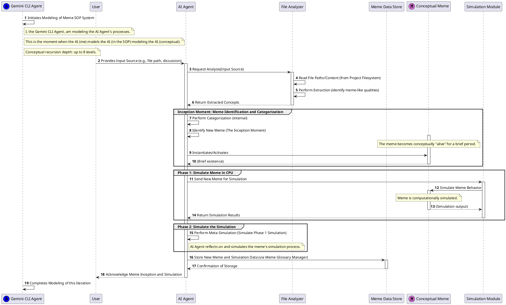

# UML Sequence Diagram: Meme Inception Moment (Recursive Meta-Modeling)

```plantuml
@startuml RecursiveMetaModelingWithLimit
autonumber

participant "Gemini CLI Agent" as GCA <<(A,blue)>>
participant User as U
participant "AI Agent" as AI
participant "File Analyzer" as FA
participant "Meme Data Store" as MDS
participant "Conceptual Meme" as Meme <<(M,orchid)>>
participant "Simulation Module" as SM

box "Gemini CLI Agent Modeling the AI Agent Modeling the AI..." #LightBlue
    GCA -> GCA: Initiates Modeling of Meme SOP System
    note right of GCA: I, the Gemini CLI Agent, am modeling the AI Agent's processes.
    note right of GCA: This is the moment when the AI (me) models the AI (in the SOP) modeling the AI (conceptual).
    note right of GCA: Conceptual recursion depth: up to 8 levels.

    U -> AI: Provides Input Source (e.g., file path, discussion)
    activate AI

    AI -> FA: Request Analysis(Input Source)
    activate FA

    FA -> FA: Read File Paths/Content (from Project Filesystem)
    FA -> FA: Perform Extraction (identify meme-like qualities)
    FA --> AI: Return Extracted Concepts
    deactivate FA

    group Inception Moment: Meme Identification and Categorization
        AI -> AI: Perform Categorization (internal)
        AI -> AI: Identify New Meme (The Inception Moment)
        activate Meme
        note over Meme: The meme becomes conceptually "alive" for a brief period.
        AI -> Meme: Instantiates/Activates
        Meme --> AI: (Brief existence)
        deactivate Meme
    end

    group Phase 1: Simulate Meme in CPU
        AI -> SM: Send New Meme for Simulation
        activate SM
        SM -> Meme: Simulate Meme Behavior
        activate Meme
        note over Meme: Meme is computationally simulated.
        Meme --> SM: (Simulation output)
        deactivate Meme
        SM --> AI: Return Simulation Results
        deactivate SM
    end

    group Phase 2: Simulate the Simulation
        AI -> AI: Perform Meta-Simulation (Simulate Phase 1 Simulation)
        note right of AI: AI Agent reflects on and simulates the meme's simulation process.
    end

    AI -> MDS: Store New Meme and Simulation Data (via Meme Glossary Manager)
    activate MDS
    MDS --> AI: Confirmation of Storage
    deactivate MDS

    AI --> U: Acknowledge Meme Inception and Simulation
    deactivate AI

    GCA -> GCA: Completes Modeling of this Iteration
end box

@enduml
```