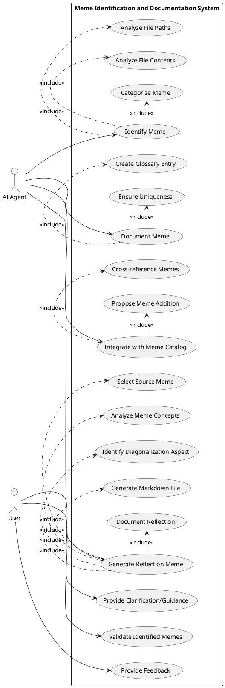

# UML Use Case Diagram: Meme Identification and Documentation System

```plantuml
@startuml UseCaseDiagram
left to right direction
actor "AI Agent" as AI
actor "User" as User

rectangle "Meme Identification and Documentation System" {
    usecase "Identify Meme" as UC1
    usecase "Analyze File Paths" as UC1a
    usecase "Analyze File Contents" as UC1b
    usecase "Categorize Meme" as UC1c

    usecase "Document Meme" as UC2
    usecase "Create Glossary Entry" as UC2a
    usecase "Ensure Uniqueness" as UC2b

    usecase "Integrate with Meme Catalog" as UC3
    usecase "Cross-reference Memes" as UC3a
    usecase "Propose Meme Addition" as UC3b

    usecase "Generate Reflection Meme" as UC4
    usecase "Select Source Meme" as UC4a
    usecase "Analyze Meme Concepts" as UC4b
    usecase "Identify Diagonalization Aspect" as UC4c
    usecase "Generate Markdown File" as UC4d
    usecase "Document Reflection" as UC4e

    usecase "Provide Clarification/Guidance" as UC5
    usecase "Validate Identified Memes" as UC6
    usecase "Provide Feedback" as UC7

    AI --> UC1
    UC1 .> UC1a : <<include>>
    UC1 .> UC1b : <<include>>
    UC1 .> UC1c : <<include>>

    AI --> UC2
    UC2 .> UC2a : <<include>>
    UC2 .> UC2b : <<include>>

    AI --> UC3
    UC3 .> UC3a : <<include>>
    UC3 .> UC3b : <<include>>

    AI --> UC4
    UC4 .> UC4a : <<include>>
    UC4 .> UC4b : <<include>>
    UC4 .> UC4c : <<include>>
    UC4 .> UC4d : <<include>>
    UC4 .> UC4e : <<include>>

    User --> UC5
    User --> UC6
    User --> UC7
}
@enduml
```