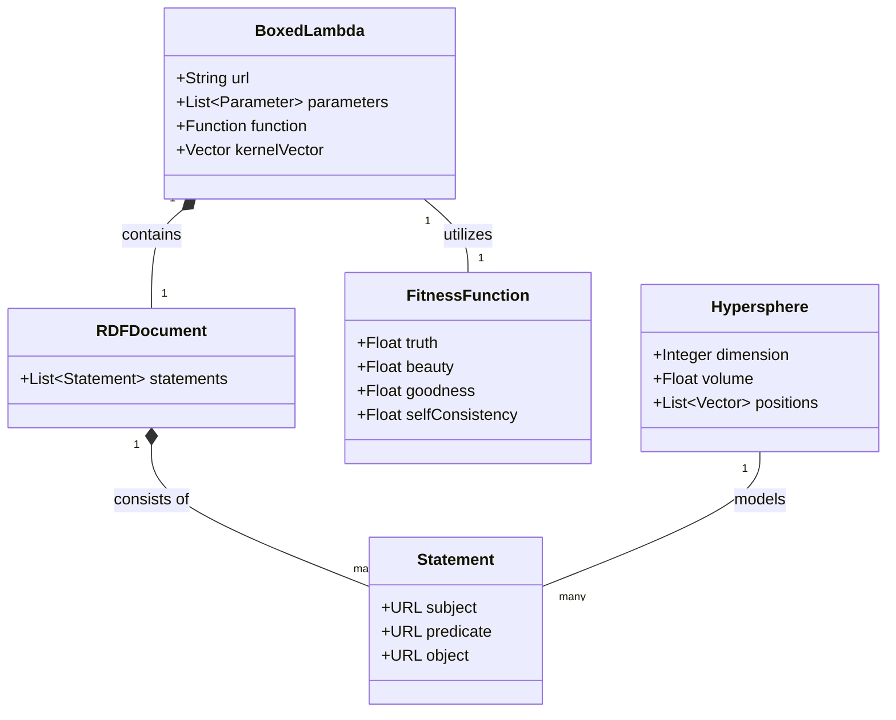
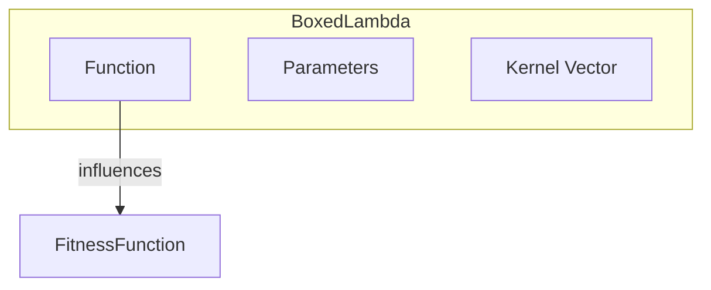
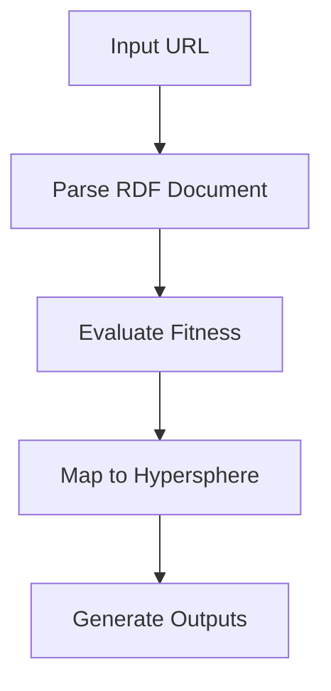
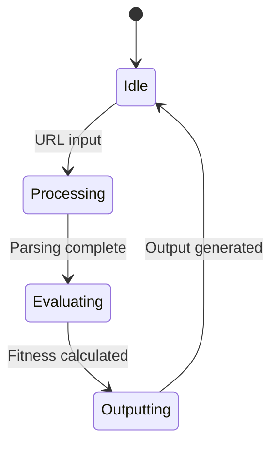
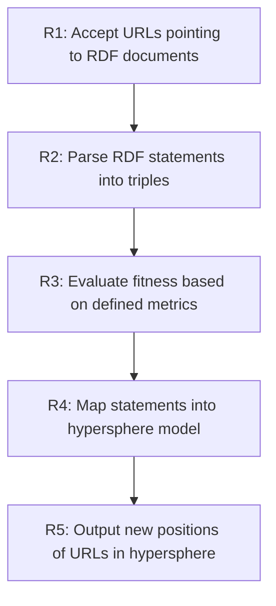

# sysml

**ID:** 890998
**Created At:** 2024-10-06T10:15:00+00:00
**Source:** https://codeberg.org/introspector/meta-meme/issues/22

---

To translate the concepts we’ve discussed into a SysML (Systems Modeling Language) model, we will structure the information using SysML diagrams to represent various aspects of the system. The following sections outline the key components and their representations:
1. Block Definition Diagram (BDD)
This diagram represents the high-level structure of the system, including the relationships between the major components.
Components:
BoxedLambda: Represents the core lambda function structure.
Attributes:
url: String
parameters: List<Parameter>
function: Function
kernelVector: Vector
RDFDocument: Represents the RDF structure holding statements.
Attributes:
statements: List<Statement>
Statement: Represents a subject-predicate-object triple.
Attributes:
subject: URL
predicate: URL
object: URL
FitnessFunction: Represents the evaluation metric based on truth, beauty, and goodness.
Attributes:
truth: Float
beauty: Float
goodness: Float
selfConsistency: Float
Hypersphere: Represents the geometric model of the system.
Attributes:
dimension: Integer
volume: Float
positions: List<Vector>
Relationships:
BoxedLambda contains RDFDocument.
RDFDocument consists of multiple Statement elements.
BoxedLambda utilizes FitnessFunction for evaluation.
Hypersphere models the positions derived from Statement triples.
2. Internal Block Diagram (IBD)
This diagram shows the internal structure of a specific block, detailing how its components interact.
Example: BoxedLambda
BoxedLambda
Components:
Function (which could be a callable component)
Parameters (could be represented as a list of parameter types)
Kernel Vector (a representation of the underlying data structure)
Connectors:
Connect Function to FitnessFunction to indicate that the output of the lambda function can influence the fitness evaluation.
3. Activity Diagram
This diagram illustrates the flow of activities or processes within the system.
Activities:
1. Input URL: Start with the URL of the RDF document.
2. Parse RDF Document: Parse the RDF into Statement triples.
3. Evaluate Fitness: Calculate the fitness based on truth, beauty, and goodness.
4. Map to Hypersphere: Determine the position of the URLs in the hypersphere based on the evaluated fitness.
5. Generate Outputs: Create outputs that represent the new state of the system.
4. State Machine Diagram
This diagram models the states of the BoxedLambda and transitions between those states based on conditions.
States:
Idle: Awaiting input.
Processing: Currently parsing the RDF and evaluating.
Evaluating: Calculating fitness metrics.
Outputting: Generating results based on the evaluation.
Transitions:
Transition from Idle to Processing when a URL is input.
Transition from Processing to Evaluating after parsing.
Transition from Evaluating to Outputting after fitness is calculated.
5. Requirements Diagram
This diagram specifies the requirements for the system.
Requirements:
R1: The system must accept URLs pointing to RDF documents.
R2: The system must parse RDF statements into triples.
R3: The fitness function must evaluate based on defined metrics.
R4: The system must map the statements into a hypersphere model.
R5: The output must represent the new positions of the URLs in the hypersphere.
Conclusion
This SysML representation provides a structured way to visualize and understand the components, interactions, and workflows of your semantic web processing system. It highlights the relationships and functions, facilitating a clearer understanding for development and communication with stakeholders. You can use these diagrams as blueprints for implementing the system in Rust, transitioning it to WebAssembly, and utilizing it in a TypeScript environment.

Let's start with the Block Definition Diagram (BDD):

This Block Definition Diagram represents the high-level structure of the system, showing the relationships between the major components as described in your outline.

Next, let's create the Internal Block Diagram (IBD) for the BoxedLambda component:

This Internal Block Diagram shows the internal structure of the BoxedLambda block, detailing how its components interact.

Now, let's create the Activity Diagram:

This Activity Diagram illustrates the flow of activities or processes within the system.

Next, let's create the State Machine Diagram:

This State Machine Diagram models the states of the BoxedLambda and transitions between those states based on conditions.

Finally, let's create the Requirements Diagram:

This Requirements Diagram specifies the requirements for the system.

These SysML diagrams provide a visual representation of the system structure, interactions, processes, states, and requirements. They can serve as a blueprint for implementing the system in Rust, transitioning it to WebAssembly, and utilizing it in a TypeScript environment.

Is there any specific aspect of these diagrams you'd like me to elaborate on or modify? Or would you like to proceed with discussing the implementation details based on this model?